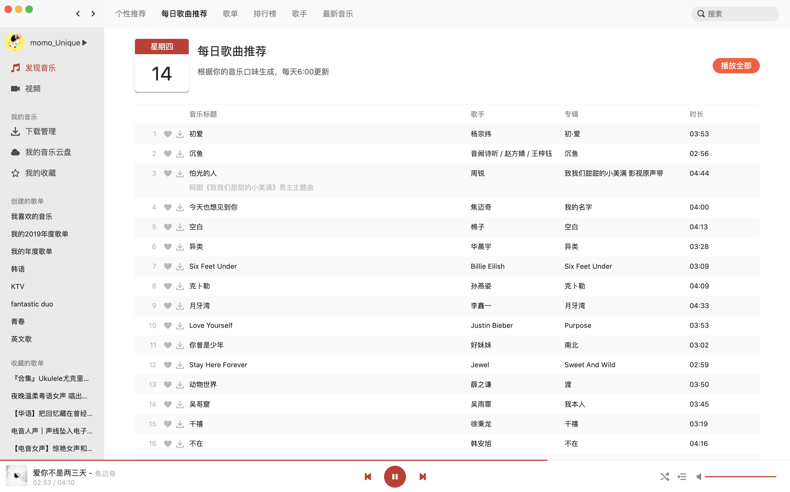
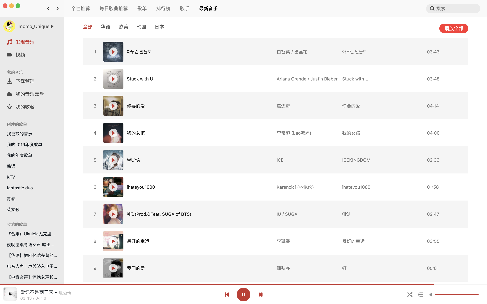
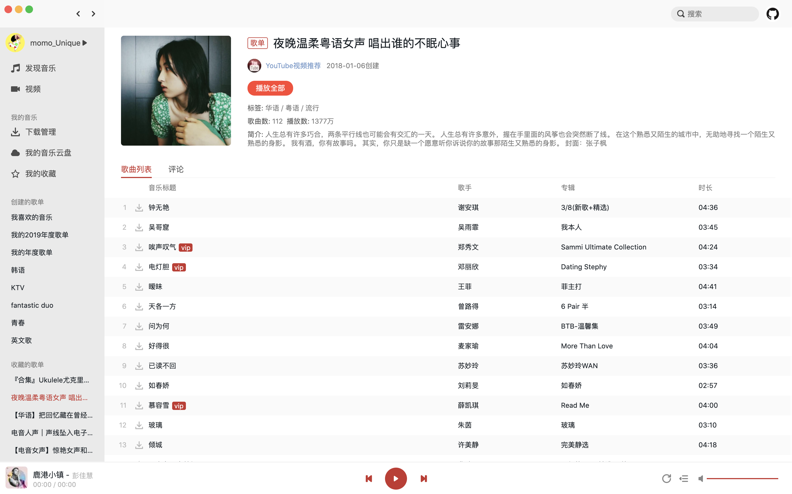
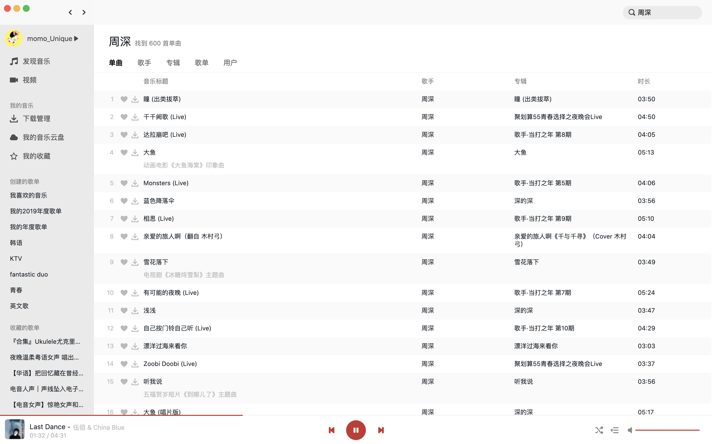

# React Netease Music

React Netease Music——一个基于 React、TypeScript 的高仿网易云 mac 客户端播放器。

## 项目体验地址

[高仿网易云音乐播放器——音为爱呀 😍](http://www.uniquemo.cn/discovery)

## 功能列表

-   [x] 登录/登出（目前仅支持手机密码登录）
-   [x] 发现页
    -   [x] banner
    -   [x] 推荐歌单
    -   [x] 推荐最新音乐
    -   [x] 推荐 MV（仅是入口，详情待实现）
-   [x] 每日歌曲推荐页
-   [x] 全部歌单页
    -   [x] 歌单分类查询
-   [x] 最新音乐页
-   [x] 歌单详情页
-   [x] 音乐播放详情页
    -   [x] 歌曲评论
    -   [x] 点赞/取消点赞歌曲评论
    -   [x] 歌词滚动
    -   [x] 歌曲所在歌单
    -   [x] 相似歌曲推荐
-   [x] 播放记录功能
    -   [x] 播放列表
    -   [x] 历史记录
-   [x] 搜索功能
    -   [x] 热门搜索关键字
    -   [x] 搜索建议
    -   [x] 搜索结果页
-   [x] 创建的歌单列表
-   [x] 收藏的歌单列表
-   [ ] 排行榜
-   [ ] 所有歌手页
-   [ ] 歌手详情页
-   [ ] MV 相关的页面与功能
-   [ ] 创建/编辑/删除歌单
-   [ ] 私信/@我/评论等通知功能
-   [ ] 主题换肤
-   [ ] ......看心情添加功能 😂

注意：部分歌曲可能由于版权问题无法播放喔。

## 技术栈

-   React，使用 react hook 做状态管理，没有使用额外的数据管理库。
-   TypeScript，用 TypeScript 确实可以提高效率 😃（容易发现错误）。
-   Graphql，使用@apollo/client 优化部分页面性能。
-   @blueprintjs 组件库，主要使用其中的 Icon、Dialog、Toast、Spinner 等。
-   逐渐使用[@uniquemo/mui](https://github.com/uniquemo/mui)替换@blueprinjs（Doing）。
-   CSS Modules。
-   Webpack。
-   Eslint 做代码检查。

## API 接口

-   [NeteaseCloudMusicApi](https://binaryify.github.io/NeteaseCloudMusicApi)
-   [Express Graphql Server](https://github.com/uniquemo/express-graphql-server)

## 播放器的相关截图












## 项目启动

-   首先将上面 👆 提到的 API 接口部分，两个 API 服务代码拉到本地，并启动对应的服务；
-   [安装`pnpm`包管理工具](https://pnpm.io/installation)；
-   然后拉取本仓库代码，并执行以下命令：

```
pnpm install
pnpm run dev:local
```

-   最后在浏览器中访问：`http://localhost:8080`


1. 安装 Husky 和 lint-staged 

2. 初始化 Husky
    npx husky install

这会在项目根目录下创建一个 .husky/ 文件夹，用于存放 Git hooks。接下来，把 Husky 自动挂载在 postinstall 脚本中，确保每次安装依赖时都会自动设置：


{
  "scripts": {
    "postinstall": "husky install"
  }
}

3. 添加预提交钩子
npx husky add .husky/pre-commit "npx lint-staged"

这将在 .husky/pre-commit 文件中添加一个默认的钩子，用于在提交前运行 lint-staged。现在我们将配置 lint-staged。

4. 配置 lint-staged

4. 配置 lint-staged
在 package.json 中添加 lint-staged 配置来指定哪些文件可以被提交，哪些需要格式化或检查。以下是一个示例配置：

json
复制代码
{
  "lint-staged": {
    "*.js": [
      "eslint --fix",    // 对所有 JavaScript 文件运行 ESLint 并自动修复
      "prettier --write", // 运行 Prettier 格式化
      "git add"           // 确保修改后的文件被加入提交
    ],
    "*.css": [
      "stylelint --fix", // 对 CSS 文件运行 stylelint
      "git add"
    ],
    "*.md": [
      "prettier --write", // 对 Markdown 文件运行 Prettier 格式化
      "git add"
    ],
    "*": "git add"       // 添加所有被修改的文件
  }
}